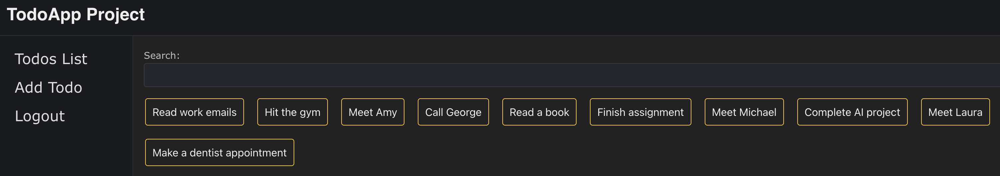
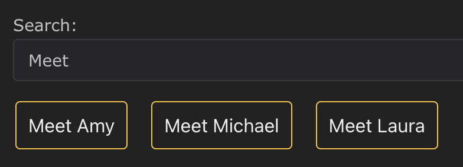
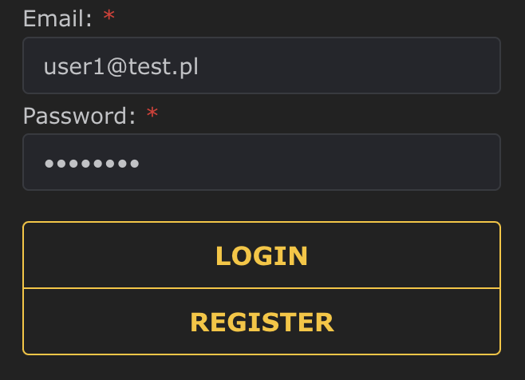
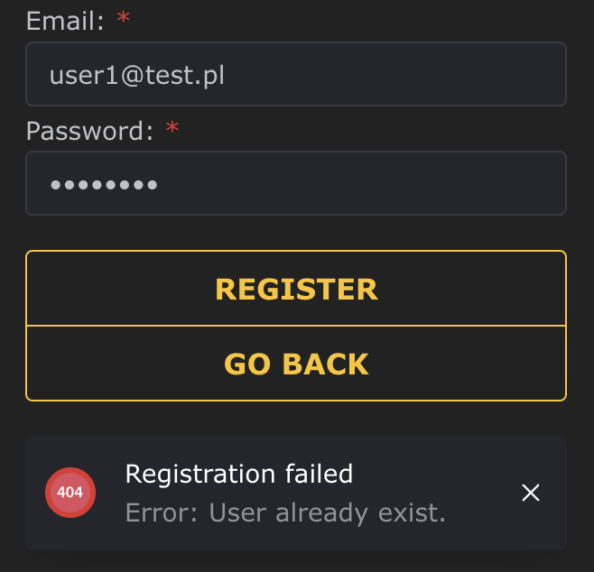

# TodoApp

This is a simple Todo List App created with React, NestJS, SQLite, Prisma.

## Features
- Login system
- New user registration
- Displaying an individual todo list
- Adding new items to the list
- Remove items from the list
- Find list items by title
- Logout user






## How to use

This project is divided into two sections - backend (NestJS) and frontend (React).

Clone this repository: 

```
git clone https://github.com/patrykmurzyn/TodoApp
```

### Setup Backend

```
cd patrykmurzyn/backend/todo-backend
sudo npm install @nestjs/config
touch .env
```

Open .env file and add these lines:

```
DATABASE_URL="file:./dev.db"
JWT_KEY="Your secret KEY"
```

Run the backend with:

```
sudo npm run start:dev
```

### Setup Frontend:

Open new terminal window and type: 

```
cd patrykmurzyn/frontend/todolist
sudo npm start
```

Now you can use application on http://localhost:3000/login